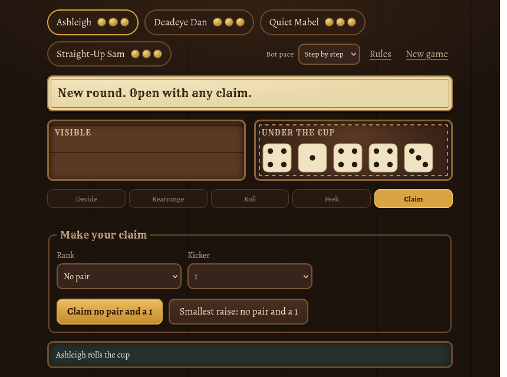
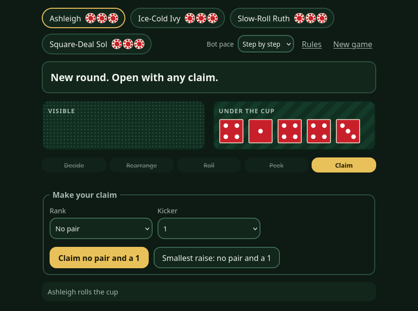

# Liar's Dice


[](LICENSE)


A pass-the-cup variant of Liar's Dice. Five dice go round the table, split into a visible set and a hidden set. On your
turn you either **pull** the cup to challenge the last claim, or **peer** at the hidden dice and claim something higher.
Lose a challenge and you lose a life. The last player standing wins.

The idea behind it is that complexity should come from removing rules, not adding them. There are no straights, a claim
only has to be strictly higher than the last one, and impossible claims are legal.

| Saloon | Casino |
|---|---|
|  |  |

## Playing

The web version runs in the browser against bots. You can drag dice between the trays, or tap them to move them.

```
cd ts
npm ci
npm run dev
```

Then open the address it prints. `npm run dev:lan` makes it reachable from a phone on the same network.

- **Basic or advanced rules.** Basic play always rolls the hidden dice and shows them to you. Advanced play lets you roll
  either set, or skip the roll or the peek.
- **Bots.** Choose up to five opponents at Easy, Normal or Stabby, or let each bot get a random level.
- **Characters.** With **Use Characters** ticked, the bots are characters from the table style's cast, each with habits
  of their own. The **Meet** link beside the table style tells you who they are. The details for the curious are in
  [`docs/tables`](docs/tables).
- **Table styles.** Saloon and Casino, each with its own cast and a colour-vision-tested palette.

The in-depth rules, for the curious, are in [`RULES.md`](RULES.md). The short version is the **How to play** page in the game.

## How it is built

| Folder | What it is |
|---|---|
| [`ts/engine`](ts/engine) | The game rules, the bots and the archetypes that give them habits. No interface and no themes. |
| [`ts/web`](ts/web) | The React app: the table, the table styles, and the personas that dress each archetype. |
| [`ts/engine/sim`](ts/engine/sim) | Simulation sweeps used to balance the bots. See its [README](ts/engine/sim/README.md). |
| [`docs`](docs) | Per-style character READMEs, screenshots and the coverage badges. |

The engine knows how a bot plays and nothing about how it looks. A table style supplies the names and bios, and a bio
cannot change how a bot plays.

## Tests and coverage

```
cd ts
npm test               # engine and web suites
npm run test:slow      # the slow strength check: no character may change how strong a bot is
npm run test:coverage  # coverage for both packages, with a floor that fails if it slips
npm run badges         # coverage, then regenerate the badges in docs/badges
```

The coverage badges are files in this repository, drawn from the last `npm run badges`, so they are only as fresh as
that run.

## License

[MIT](LICENSE)
